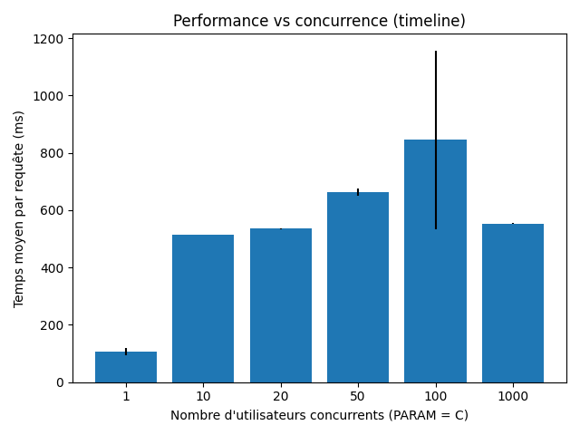
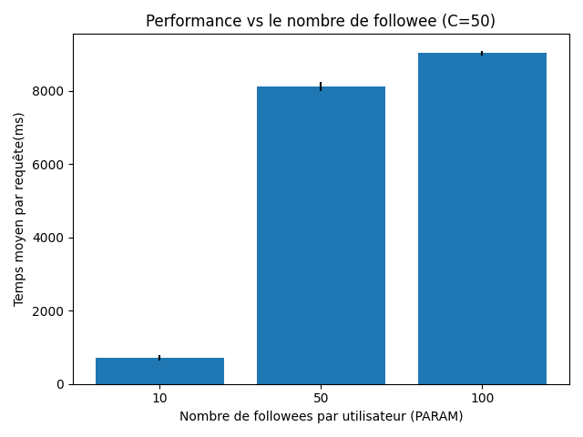
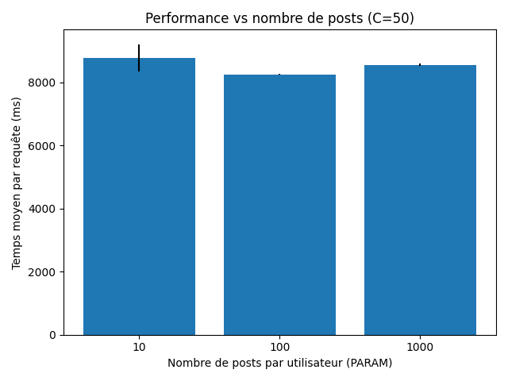

# Projet Massive Data & Cloud – Benchmark TinyInsta (GCP Datastore + App Engine)

## 1. Contexte

Ce projet évalue les performances de l’application TinyInsta (mini réseau social) déployée sur **Google App Engine** et utilisant **Google Cloud Datastore**.  
On mesure le temps moyen de génération d’une timeline via l’endpoint :

```http
GET /api/timeline?user=<username>&limit=20
```

L’objectif est de voir comment ce temps évolue :

1. Quand on augmente le **nombre d’utilisateurs concurrents**.
2. Quand on augmente le **nombre de posts par utilisateur**.
3. Quand on augmente le **nombre de followees par utilisateur**.

Les résultats sont fournis sous forme de fichiers CSV et de barplots.

---

## 2. Liens

* **Application déployée** : `https://hip-return-473713-r7.appspot.com/`
* **Dépôt GitHub/GitLab** : `https://github.com/nikaSolRX/PROJET-DONNEES-MASSIVES-ET-CLOUD.git`


---

## 3. Structure du dépôt

```text
.
├── out/                      # Résultats (CSV + PNG)
│   ├── conc.csv
│   ├── post.csv
│   ├── fanout.csv
│   ├── conc.png
│   ├── post.png
│   └── fanout.png
├── app.yaml                  # Config App Engine
├── index.yaml                # Index Datastore
├── main.py                   # Application TinyInsta (Flask + Datastore)
├── seed.py                   # Script de peuplement Datastore
├── nettoyage_dataset.py      # Script de nettoyage du datastore 
├── bench_conc_multi.py       # Benchmark concurrence
├── bench_post_multi.py       # Benchmark nombre de posts
├── bench_fanout_multi.py     # Benchmark nombre de followees
├── requirements.txt          # Dépendances Python
└── README.md                 # Ce fichier

```

Les fichiers CSV sont dans le dossier `out/`, comme demandé dans la consigne.

---

## 4. Génération des données (seed)

Les datasets sont générés avec `seed.py`, qui :

* crée un ensemble d’utilisateurs `prefix1`, `prefix2`, …
* leur assigne des followees aléatoires dans une plage `[follows-min, follows-max]`
* crée un nombre donné de posts répartis sur ces utilisateurs

---

## 5. Méthodologie de benchmark

### 5.1 Principe général

Au lieu d’utiliser `ab` (Apache Bench), les benchmarks sont écrits en **Python** pour respecter la consigne :

> Quand on teste les timelines, on teste des timelines différentes, c’est-à-dire :
> 50 utilisateurs simultanés vont chercher 50 timelines différentes (50 URLs distinctes en parallèle).

Le principe commun des scripts :

1. Générer le dataset approprié avec `seed.py`.
2. Choisir une liste d’utilisateurs (par ex. `conc1`…`concC`).
3. Envoyer **1000 requêtes HTTP** vers `/api/timeline` en répartissant ces requêtes sur ces utilisateurs.
4. Utiliser un `ThreadPoolExecutor` pour exécuter les requêtes en parallèle.
5. Mesurer la **latence de chaque requête**, calculer la moyenne, répéter 3 fois.
6. Écrire les résultats dans un CSV (`PARAM,AVG_TIME,RUN,FAILED`) et produire un barplot.

### 5.2 Respect de la consigne “timelines différentes”

Pour une concurrence `C` ou un paramètre donné :

* le script construit une liste de `C` utilisateurs différents (par ex. `conc1`…`concC`, `posts10_1`… ou `fanout50_1`… selon le préfixe),
* les 1000 requêtes sont réparties sur ces utilisateurs (division + reste),
* chaque thread envoie des requêtes pour un **utilisateur unique** (`/api/timeline?user=<userX>`).

Ainsi, par exemple :

* pour `C = 50`, il y a **50 threads**,
* chaque thread interroge la timeline d’un user distinct,
* on obtient bien 50 timelines différentes en parallèle.

### 5.3 Scripts de benchmark

#### `bench_conc_multi.py` – benchmark concurrence

* Paramètres testés : `C = 1, 10, 20, 50, 100, 1000`.
* Contexte de données : 1000 utilisateurs, ~50 posts/user, 20 followees/user.
* Pour chaque `C` et chaque run :

  * 1000 requêtes réparties sur `C` utilisateurs `conc1`…`concC`.
  * Enregistrement de la moyenne en millisecondes dans `out/conc.csv`.
* Génère le graphique `out/conc.png`.

#### `bench_post_multi.py` – benchmark nombre de posts

* Paramètres testés : `10, 100, 1000` posts par utilisateur.
* Concurrence fixée : `C = 50` utilisateurs simultanés.
* Chaque paramètre utilise un préfixe différent (`posts10`, `posts100`, `posts1000`).
* Pour chaque paramètre et chaque run :

  * 1000 requêtes réparties sur 50 utilisateurs, timelines différentes.
  * Résultats dans `out/post.csv`.
* Génère `out/post.png`.

#### `bench_fanout_multi.py` – benchmark nombre de followees

* Paramètres testés : `10, 50, 100` followees par utilisateur.
* Concurrence fixée : `C = 50` utilisateurs simultanés.
* Préfixes de users : `fanout10`, `fanout50`, `fanout100`.
* Pour chaque paramètre et chaque run :

  * 1000 requêtes réparties sur 50 utilisateurs.
  * Résultats dans `out/fanout.csv`.
* Génère `out/fanout.png`.

---

## 6. Résultats et interprétation

### 6.1 Concurrence – `conc.png`



* On observe une augmentation nette du temps moyen par requête quand la concurrence passe de 1 → 10 → 20 → 50 → 100 utilisateurs.
* Le point `C = 100` présente le temps le plus élevé et une variance importante.
* À `C = 1000`, le temps moyen diminue légèrement par rapport à `C = 100`.
  Cela peut s’expliquer par l’**autoscaling d’App Engine**, qui crée davantage d’instances pour absorber la très forte charge.
* Globalement, la tendance confirme que **plus il y a d’utilisateurs simultanés, plus la timeline est coûteuse à générer**, même si l’autoscaling atténue le pic à très haute charge.

---

### 6.2 Nombre de followees – `fanout.png`



* Paramètres testés : 10, 50 et 100 followees par utilisateur, concurrence fixe à 50.
* Le passage de **10 → 50 followees** fait exploser la latence (d’environ quelques centaines de ms à plusieurs secondes).
* Le passage de **50 → 100 followees** augmente encore le temps moyen.
* Ce comportement est cohérent avec l’implémentation de la timeline : la requête utilise un filtre `IN` sur les auteurs suivis, ce qui revient à exécuter plusieurs requêtes par auteur et à fusionner les résultats triés.
* Conclusion : **le fanout (nombre de comptes suivis) est le facteur le plus pénalisant pour la performance de la timeline.**

---

### 6.3 Nombre de posts – `post.png`



* Paramètres testés : 10, 100 et 1000 posts par utilisateur, concurrence fixe à 50, 20 followees par utilisateur.
* Les temps restent élevés mais sont relativement proches pour les trois niveaux de posts.
* L’augmentation du nombre de posts ne provoque pas une explosion de latence comparable au cas “fanout”.
* Datastore s’appuie sur des index (auteur + date de création) qui permettent de récupérer efficacement les posts récents pour les auteurs suivis, même si le volume total est plus important.
* Conclusion : **le volume de posts par utilisateur a un impact, mais moins marqué que le nombre de followees**.

---

## 7. Fichiers CSV

Les fichiers CSV générés par les scripts se trouvent dans `out/` :

* `out/conc.csv`   – résultats du benchmark de concurrence
* `out/post.csv`   – résultats du benchmark sur le nombre de posts
* `out/fanout.csv` – résultats du benchmark sur le fanout

Format commun :

```text
PARAM,AVG_TIME,RUN,FAILED
...
```

* `PARAM` = valeur testée (C, nombre de posts ou nombre de followees)
* `AVG_TIME` = temps moyen par requête (ms) pour ce run
* `RUN` = numéro de run (1, 2, 3)
* `FAILED` = 0 si toutes les requêtes ont réussi, 1 si au moins une requête a échoué

---

## 8. Conclusion

Les expériences montrent que :

1. **La concurrence** fait augmenter le temps de réponse, mais App Engine gère la montée en charge grâce à l’autoscaling, ce qui évite une explosion systématique de la latence.
2. **Le nombre de followees** est le paramètre le plus critique : plus un utilisateur suit de comptes, plus la requête timeline est coûteuse (requêtes multiples, fusion et tri).
3. **Le nombre de posts** a un effet plus modéré, grâce aux index Datastore qui optimisent la récupération des posts récents.

Ces résultats sont cohérents avec le modèle de Datastore et mettent en évidence les limites d’un schéma naïf de timeline pour un réseau social : pour passer à l’échelle, il faudrait envisager des mécanismes supplémentaires (pré-calcul de timeline, sharding, cache, etc.).

```


